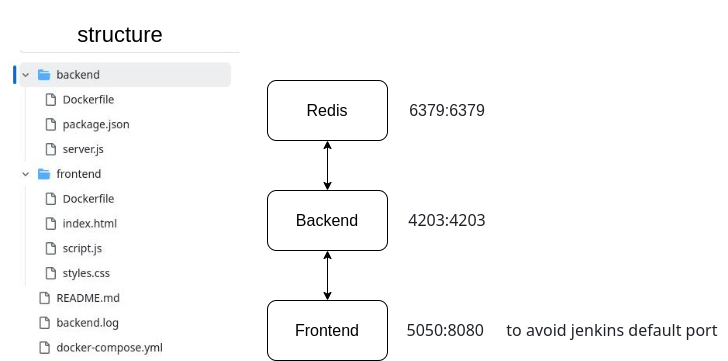

# example_docker_application

System properties
RAM:			3.75GB
HardDisk:		439GB
Operating sys:		Linux
Distro:			AntiX 
Init sys:		runnit

Introduction:
I’ve made special application for this project which is a website that counts number of clicks
Due to limited resources it was crucial to use runnit system and lightweight distro

The options were :

Devuan: rejected because of systemd.

Void: rejected due to complexity.

Antix: accepted because it’s debian based (easy to use) & init system is not systemd

redis port=6379:6379    redis default port
frontend port=5050:8080 or whatever I mapped it like that to be able to use jenkins on its default port 
backend port=4203:4203  

usage: docker compose up

